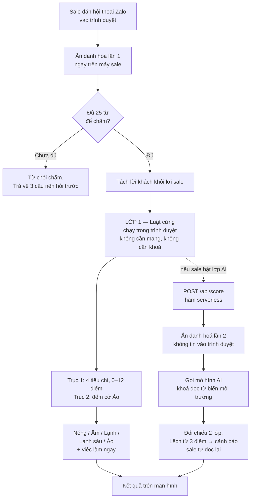

# Lọc lead chung cư

**Dán hội thoại Zalo. Trong 10 giây biết lead nào Ảo để bỏ, lead nào Nóng để gọi trước — và có ngay hồ sơ khách đã điền sẵn, không phải gõ chữ nào.**

Dự án học viên — cohort *Build to Own* (AromAI Lab, 09/2026).

---

## 1. Vấn đề

Một sale căn hộ chung cư ở Hà Nội hoặc TP.HCM nhận 30–80 lead một tháng, phần lớn từ quảng cáo của công ty hoặc chủ đầu tư rót xuống. Phần lớn thời gian trong ngày của họ đi vào việc **gọi điện để phát hiện ra người đó không phải khách mua**.

Ba loại lead ăn thời gian nặng nhất:

- **Môi giới đối thủ dò giá** — hỏi bảng hàng, chiết khấu, hoa hồng, xưng là khách mua. Đây là loại tốn thời gian nhất và **không tool nào trên thị trường bắt**.
- **Người tham khảo dài hạn** — hỏi "còn căn nào không, giá bao nhiêu" rồi biến mất.
- **Spam và lừa đảo** — gửi link, mời chào ngược.

Việc phân loại hiện làm bằng cảm tính, mỗi sale một kiểu, không có tiêu chí cố định.

## 2. Dành cho ai

Sale căn hộ chung cư **từ 1 năm nghề trở lên**, nhận lead từ quảng cáo công ty hoặc tự đăng bài trên trang cá nhân, bán trực tiếp cho khách cá nhân.

Người dùng này **không có Zalo OA, không có CRM, và không cài đặt gì cả**. Đó là ràng buộc thiết kế quan trọng nhất: sản phẩm phải chạy được chỉ với một đường link và thao tác dán.

## 3. Hoạt động thế nào



### Hai trục, không phải một thang điểm

Đây là quyết định thiết kế cốt lõi và là chỗ khác biệt so với các tool chấm lead sẵn có.

| Trục | Trả lời câu hỏi | Thang |
|---|---|---|
| **Tiềm năng** | Người này *nếu là khách thật* thì gần chốt đến đâu? | 0–12 điểm |
| **Cờ Ảo** | Người này có thật sự là người mua không? | Đếm cờ |

**"Ảo" không phải là "điểm thấp".** Môi giới đối thủ giả làm khách có thể trả lời trơn tru và đạt điểm cao. Khách thật mới bắt đầu tìm hiểu thì điểm thấp nhưng đáng nuôi 3–6 tháng. Gộp hai thứ vào một thang điểm sẽ ném đi lead thật và giữ lại lead ảo.

Cờ **A1** (môi giới dò giá) và **A7** (lừa đảo) là *cờ quyết định*: một cờ đủ kết luận Ảo, bất kể điểm. Các cờ còn lại là tình huống, cần hai cờ.

Bộ tiêu chí đầy đủ, kèm phần "tool này chưa làm được gì": [`docs/scoring-criteria.md`](docs/scoring-criteria.md)

### Hai lớp chấm, lớp dưới không phụ thuộc lớp trên

- **Lớp 1 — luật cứng.** Chạy hoàn toàn trong trình duyệt. Không gọi mạng, không cần khoá API. Đây là lưới an toàn: mất mạng, hết hạn mức, khoá bị thu hồi thì sản phẩm **vẫn trả được kết quả**.
- **Lớp 2 — AI.** Chấm lại độc lập để bắt sắc thái mà luật cứng bỏ sót, và gợi ý tin nhắn nên gửi tiếp. Khi hai lớp lệch từ 3 điểm trở lên, sản phẩm **nói thẳng là nên tự đọc lại** thay vì giấu đi.

### Chân dung khách — vì sao chấm điểm thôi là chưa đủ

Chấm điểm trả lời câu hỏi *hôm nay gọi ai trước*. Nó không trả lời được câu hỏi ba tuần sau:
*người này là ai, đã nói gì, mình đang đứng ở đâu với họ*.

Khảo sát của Meey Land (07/2021): **97%** môi giới vẫn lưu khách bằng sổ tay hoặc Excel,
**50%** thường xuyên quên thông tin khách, **40%** lỡ hẹn — dù CRM miễn phí cho môi giới
đã có trên thị trường từ lâu.

Một CRM miễn phí có thương hiệu mà 97% vẫn dùng sổ tay, nghĩa là bức tường không nằm ở
chỗ lưu. Nó nằm ở công đoạn **gõ tay**: nhập một khách vào CRM mất 3–5 phút, sale có 40
khách thì không ai làm.

Nên sản phẩm này không bán chỗ lưu. Nó làm đúng một việc: **biến hội thoại thành bản ghi
có cấu trúc mà sale không phải gõ chữ nào.**

Sau khi chấm, tool tự điền: nhu cầu, loại căn, diện tích, ngân sách, cách thu xếp tài chính,
ai là người quyết, lý do mua, mốc thời gian, đã đi xem nơi khác chưa, đang quan tâm những gì —
cộng hai mục quan trọng nhất: **chỗ còn thiếu** và **câu nên hỏi tiếp để lấp chỗ đó**.

Sale chỉ đặt một cái tên rồi bấm Lưu. Mỗi hồ sơ có nút **Chép** ra văn bản thuần để dán
sang CRM của sàn — sản phẩm này cố ý **nạp dữ liệu cho cái tủ người ta đang dùng**,
chứ không đòi thay cái tủ đó.

Hồ sơ lưu trong `localStorage` trên máy sale, không gửi lên máy chủ nào.
Đánh đổi: xoá dữ liệu duyệt web là mất hồ sơ (có nút Xuất JSON để sao lưu),
và không đồng bộ giữa máy tính với điện thoại.

### Màu mã hoá mức độ ưu tiên, không để trang trí

Mỗi phân loại có một màu cố định: Nóng đỏ, Ấm cam, Lạnh xanh, Lạnh sâu xám, Ảo tím.
Màu đó xuất hiện nhất quán ở khối kết quả, ở khối "Việc làm ngay", ở dải thống kê và ở viền
trái mỗi thẻ hồ sơ — nên liếc một cái là biết nên gọi ai trước, không phải đọc chữ.

Sản phẩm **không dùng popup hối thúc**. Khách hàng ở đây là dân bán hàng chuyên nghiệp;
chiêu tạo khan hiếm làm giảm tin cậy thay vì tăng. Sức ép đến từ kết quả chấm: khách Nóng
thì khối việc cần làm chuyển đỏ với hạn "gọi lại trong 1 giờ".

## 4. Dữ liệu cá nhân — được xử lý ra sao

Luật Bảo vệ dữ liệu cá nhân có hiệu lực 01/01/2026 xếp số điện thoại, email, số tài khoản, số giấy tờ vào nhóm dữ liệu cá nhân. Gửi nguyên văn hội thoại tới một mô hình đặt ở nước ngoài là hành vi chuyển dữ liệu xuyên biên giới.

Sản phẩm xử lý theo ba nguyên tắc:

1. **Ẩn danh hoá trước khi rời khỏi máy.** Số điện thoại, email, số tài khoản, số giấy tờ, địa chỉ nhà và tên riêng bị thay bằng nhãn ngay trong trình duyệt. Người dùng **xem được đúng nội dung sắp gửi đi** trước khi nó được gửi.
2. **Ẩn danh hoá lại ở máy chủ.** Không tin vào trình duyệt.
3. **Không lưu hội thoại.** Không ghi vào cơ sở dữ liệu, không ghi vào log.

Thứ được **giữ lại** là giá tiền, diện tích, số tầng — vì đó là căn cứ chấm điểm, và bản thân chúng không định danh ai.

### Nói rõ dữ liệu đi đâu, ngay trên giao diện

Khối số 2 có một mục mở ra được: **"Dữ liệu đã che đi tới đâu, ai giữ, giữ bao lâu"** —
ghi thẳng đường đi (trình duyệt → máy chủ công cụ → API Anthropic), kèm **một ví dụ trước/sau**
cho thấy đúng thứ rời khỏi máy trông như thế nào, việc dữ liệu không được dùng huấn luyện mô hình,
và việc trang không có công cụ theo dõi nào.

Ví dụ trước/sau là phần quan trọng nhất của khối này. Nỗi lo thật của người dùng không phải
"bên kia giữ dữ liệu bao lâu" mà "danh sách khách của tôi có bị lấy mất không". Câu trả lời
đúng là: **thứ đi ra không phải danh sách khách hàng** — số điện thoại, email, tên đã bị bỏ
trước khi có kết nối mạng, nên không có gì trong đó để liên lạc lại với khách.

Cạnh ô *Chấm thêm bằng AI* có một dòng nói rõ: **bỏ chọn thì không dữ liệu nào rời khỏi máy** —
công cụ vẫn chấm điểm, vẫn bắt lead ảo, vẫn dựng hồ sơ bằng lớp luật cứng.

Cũng nói thẳng chỗ **chưa hoàn hảo**: bộ che chạy theo mẫu chữ chứ không phải AI, nên tên riêng
không đi kèm xưng hô có thể còn sót; và ô *Đặt tên* với *Ghi chú riêng* do người dùng tự gõ nên
không đi qua bộ che.

Minh bạch làm tăng niềm tin chứ không giảm — nhất là với sale bất động sản, nhóm bị lừa nhiều
và quen soi kỹ.

Người dùng xoá dữ liệu của mình bất cứ lúc nào: nút **Xoá tất cả** ở màn Hồ sơ, xác nhận hai bước.

## 5. Khoá API nằm ở đâu

Khoá **chỉ** được đọc trong `api/score.js`, chạy phía máy chủ.

- Không nằm trong mã nguồn.
- Không lên GitHub (`.env` bị chặn trong `.gitignore`).
- **Không bao giờ đi xuống trình duyệt.** Trình duyệt chỉ gọi `/api/score` và nhận về kết quả đã xử lý.

Không có khoá thì `/api/score` trả về `{aiTat: true}` kèm lý do, và giao diện hiển thị kết quả của lớp luật cứng. **Đây là đường đi bình thường, không phải trạng thái lỗi.**

## 6. Cấu trúc mã nguồn

```
public/
  index.html          Giao diện, một trang
  style.css
  app.js              Điều phối: ẩn danh hoá → luật cứng → gọi AI → hiển thị
  lib/
    anonymize.js      Ẩn danh hoá. Dùng chung cho trình duyệt và máy chủ
    criteria.js       Động cơ chấm điểm — 2 trục, 4 tiêu chí, 7 cờ Ảo
    profile.js        Trích chân dung khách từ hội thoại. Không giữ lại hội thoại gốc
    store.js          Kho hồ sơ trong localStorage: lưu, tìm, xếp ưu tiên, xuất JSON, xoá sạch
    samples.js        Hội thoại mẫu để thử ngay
api/
  score.js            Hàm serverless. NƠI DUY NHẤT đọc khoá API
docs/
  scoring-criteria.md Bộ tiêu chí đầy đủ, kèm phần hạn chế
test/
  fixtures.js         6 hội thoại thật, mỗi ca một loại
  profile-tests.js    Kiểm thử chân dung khách và kho hồ sơ
  run-tests.js        59 phép kiểm thử
dev-server.js         Máy chủ chạy thử trên máy cá nhân
```

**Ba chỗ đáng đọc trước:**

| Tệp | Vì sao |
|---|---|
| `public/lib/criteria.js` | Toàn bộ logic sản phẩm nằm ở đây. Đọc phần chú thích đầu tệp để hiểu vì sao tách 2 trục. |
| `api/score.js` | Ranh giới bảo mật. Mọi thứ liên quan tới khoá API nằm gọn trong tệp này. |
| `docs/scoring-criteria.md` | Mục 6 liệt kê thẳng những gì tool **chưa** làm được. |

## 7. Chạy trên máy

```bash
npm test          # 59 phép kiểm thử, không cần mạng, không cần khoá
node dev-server.js  # mở http://localhost:3000
```

Muốn bật lớp AI thì sao chép `.env.example` thành `.env` và điền khoá. Tệp `.env` **không bao giờ** được commit.

## 8. Deploy

Hosting: Vercel. Thư mục `public/` là tệp tĩnh, thư mục `api/` là hàm serverless — không cần cấu hình thêm.

Sau khi deploy, đặt các biến sau trong **Environment Variables** của Vercel, bật chế độ che giá trị:

| Biến | Bắt buộc | Ý nghĩa |
|---|---|---|
| `ANTHROPIC_API_KEY` | Không | Thiếu thì sản phẩm chạy bằng lớp luật cứng |
| `SCORING_MODEL` | Không | Mặc định `claude-haiku-4-5-20251001` |
| `AI_ENABLED` | Không | Đặt `false` để tắt lớp AI mà không cần xoá khoá |

## 9. Còn phải làm

| Việc | Vì sao chưa làm |
|---|---|
| Hiệu chuẩn ngưỡng 9/6/3 bằng 30 lead đã biết kết quả | Ngưỡng hiện tại là suy luận, chưa có dữ liệu thật |
| Phỏng vấn 5 sale | Giả định lớn nhất chưa kiểm chứng: sale có chịu dán từng hội thoại không |
| Nhận ảnh chụp màn hình hội thoại | Bản này mới nhận văn bản dán |
| Phân biệt phân khúc (bình dân / cao cấp) | Khách 2 tỷ và khách 15 tỷ hỏi khác nhau |

---

*Công cụ hỗ trợ ra quyết định, không thay thế phán đoán của sale.*
